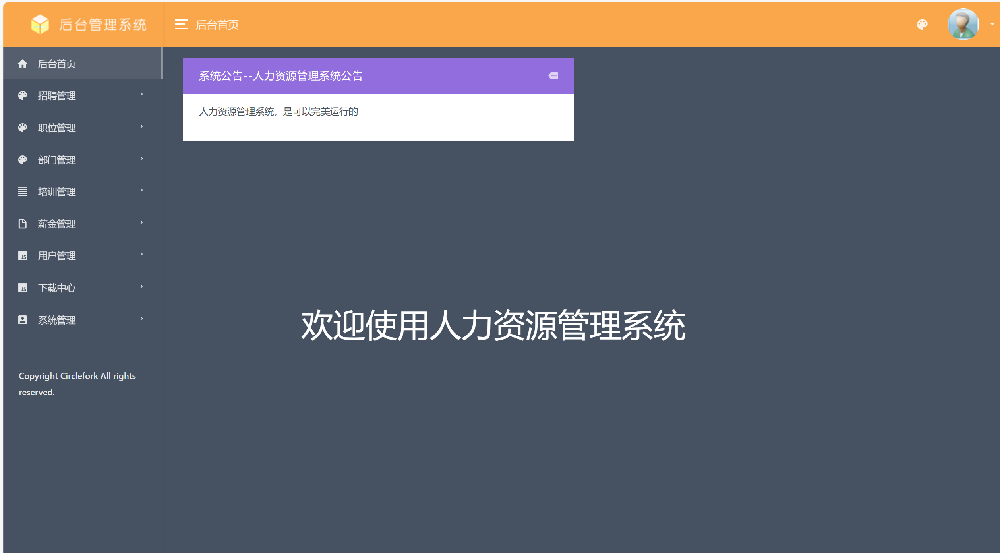
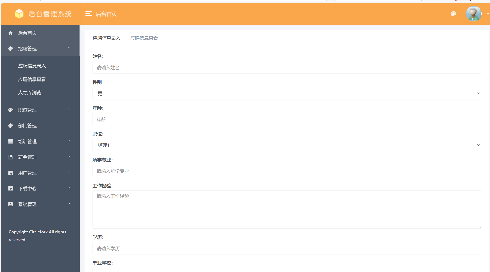
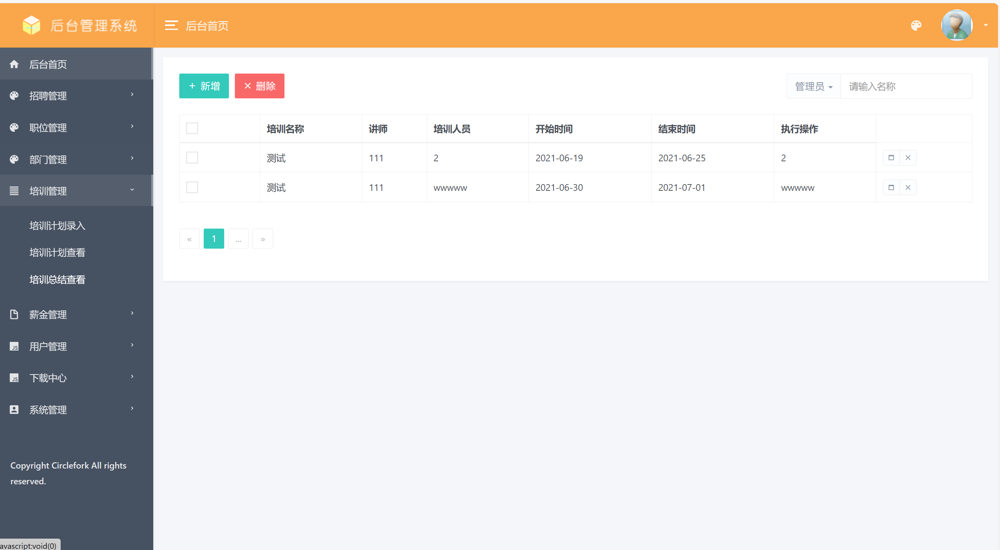
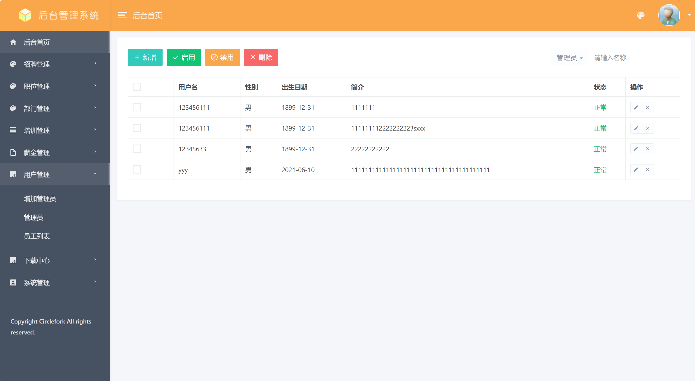
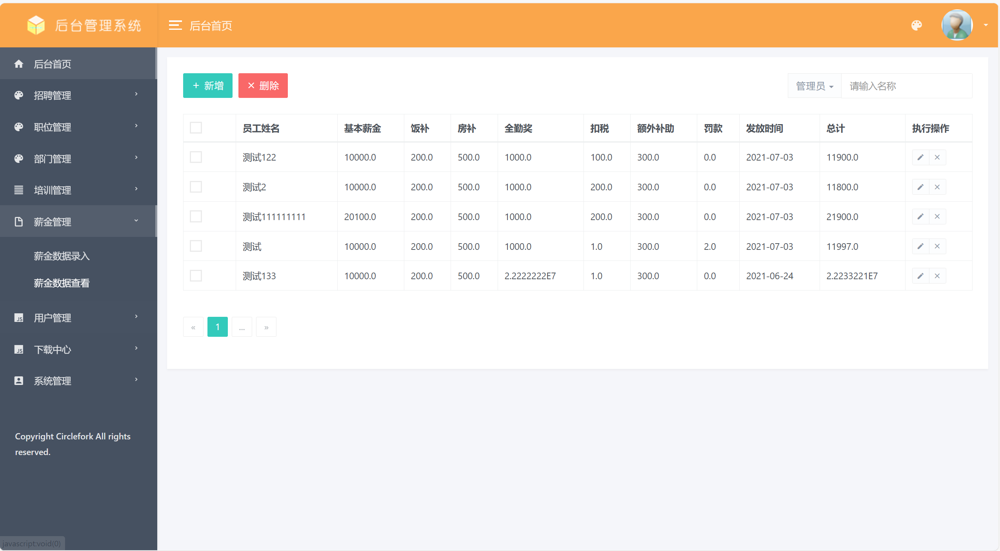
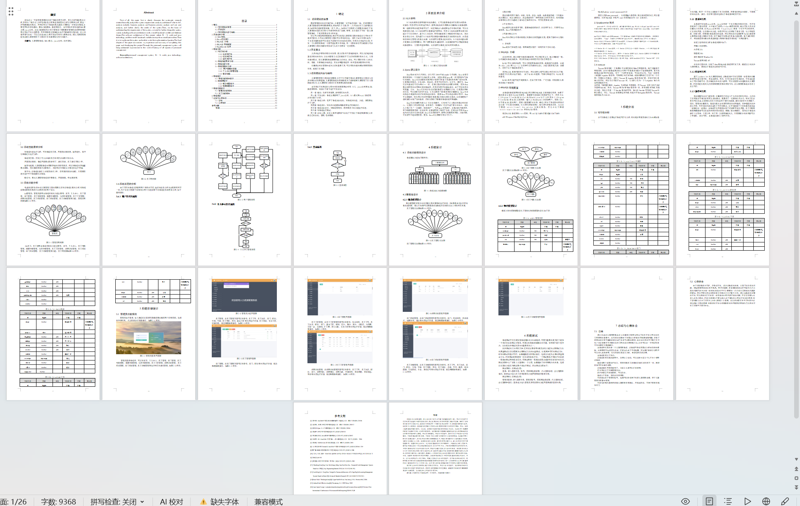

# jspServlet026
jspServlet026人力人事资源薪资管理系统+BG
 
## 源码问题查看主页咨询

### 一、关键词

人力人事资源薪资管理系统，人力资源系统

### 二、作品包含
源码+数据库+设计报告文档+全套环境和工具资源+本地部署教程

### 三、项目技术
前端技术：Html、Css、Js、Jquery、Bootstrap
后端技术：Java、JSP、Servlet、JDBC

### 四、运行环境（以下版本亲测，其他版本兼容性请自行测试）
开发工具：IDEA/eclipse

数据库：MySQL5.7或8.0

服务器：Tomcat8.5或Tomcat9.0

数据库管理工具：Navicat10以上版本

环境配置软件： JDK1.8

浏览器：谷歌浏览器

### 五、项目介绍
项目编号：jspServlet026

本项目软件架构选择B/S模式和java技术，总体功能模块包含员工管理部门管理薪资管理培训招聘管理运用自顶向下的分层思想。再然后就是实现系统并进行代码编写实现功能。论文的最后章节总结一下自己完成本论文和开发本项目的心得和总结。通过人事管理系统将会使人事管理各个方面的工作效率带来实质性的提升。

管理员；管理员使用本系统涉到的功能主要有：首页，个人中心，员工管理，部门管理，员工考勤管理，请假申请管理，加班申请管理，员工工资管理，招聘计划管理，员工培训管理，部门培训管理，员工详细管理等功能。

员工；员工使用本系统涉到的功能主要有：首页，个人中心，员工考勤管理，请假申请管理，加班申请管理，员工工资管理，招聘计划管理，员工培训管理，部门培训管理，员工详细管理等功能。

### 六、运行截图

